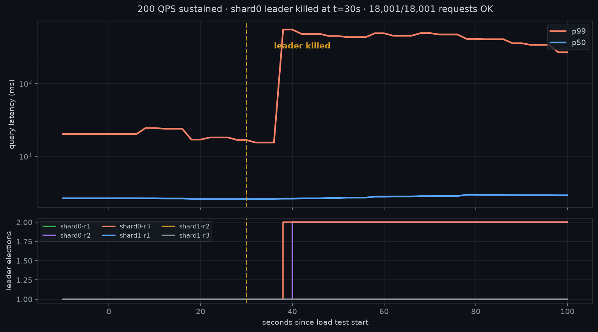
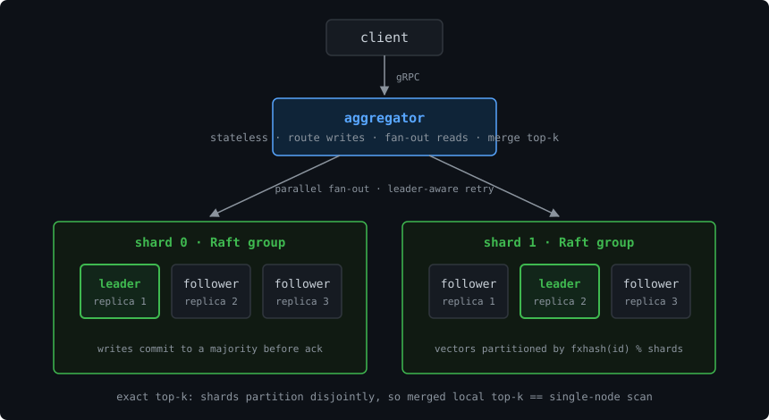
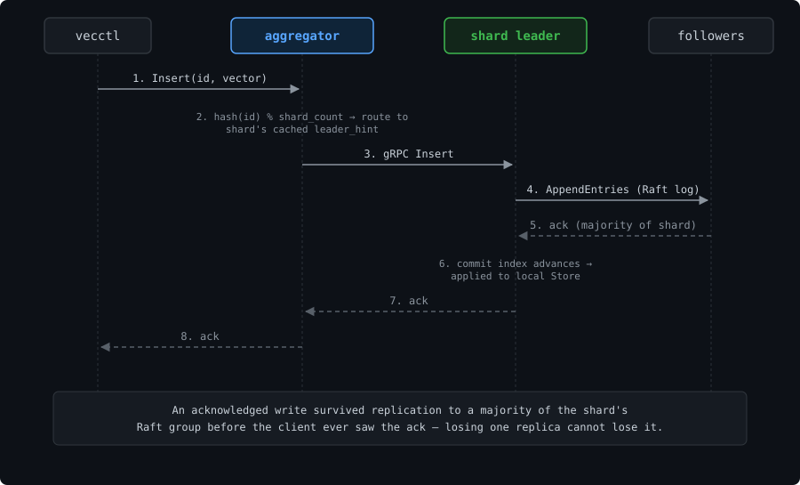
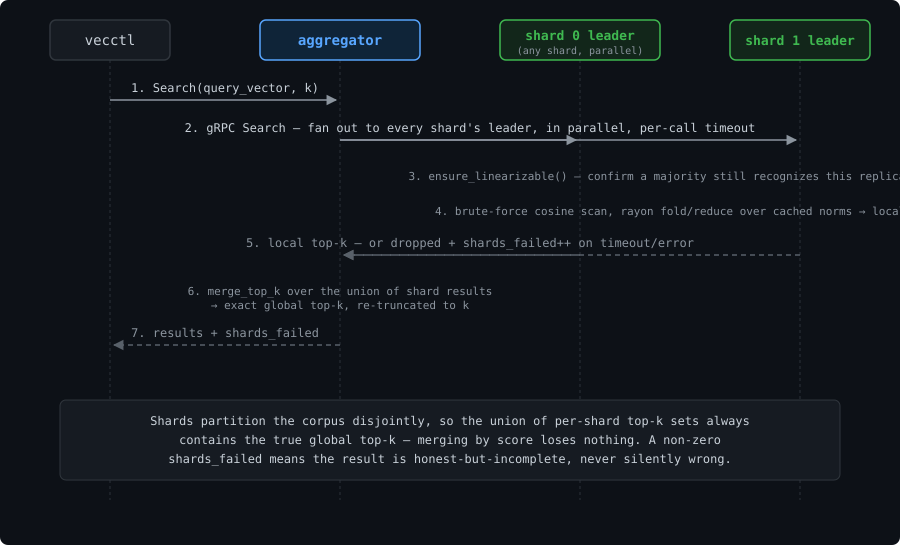
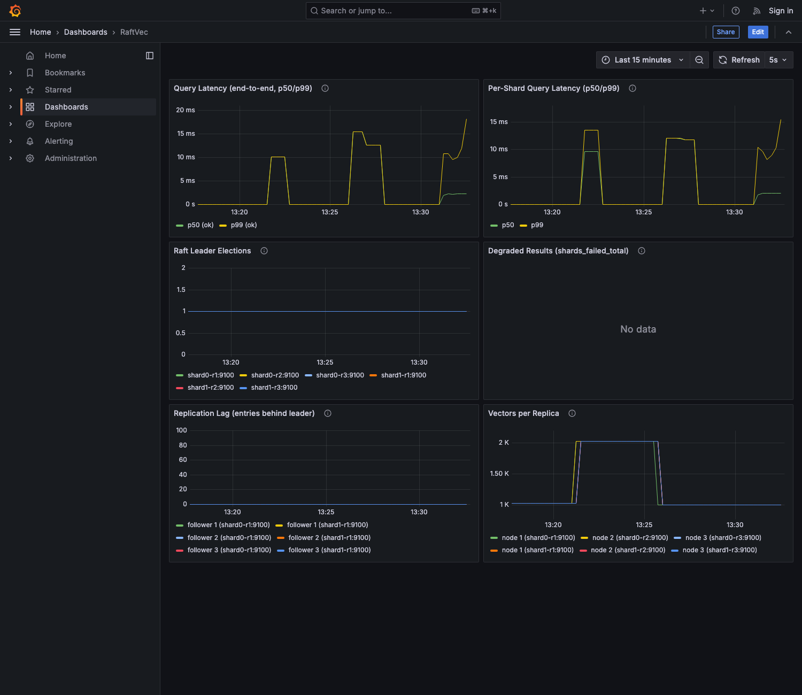

<div align="center">

# RaftVec

**A distributed vector search engine where every shard is a Raft-replicated group.**

Kill a shard leader mid-traffic — the cluster keeps returning complete, correct results,
with zero acknowledged writes lost.

[](https://github.com/hiepnnguyentcu/raftvec/actions/workflows/ci.yml)
[](https://github.com/hiepnnguyentcu/raftvec/releases/latest)
[](https://www.rust-lang.org)
[](LICENSE)
[](https://github.com/databendlabs/openraft)



*A shard leader killed at t=30s under 200 QPS. The median never notices. 18,001/18,001 requests OK.*

This project is inspired by a lot from MuopDB - Check it out here!: https://github.com/hicder/muopdb

</div>

---

## Features

**Correctness & consistency**
- Writes commit to a Raft majority of the owning shard before they're acknowledged — no acknowledged write is ever lost to a single node failure.
- Reads pass a ReadIndex-style `ensure_linearizable()` quorum check before serving — an isolated ex-leader refuses to answer instead of returning stale data.
- Per-shard search is exact brute-force cosine, not approximate — the distributed top-k is provably identical to a single-node scan over the same data, verified continuously by an oracle test.
- Partial failures are surfaced, never hidden: `shards_failed > 0` in the response instead of a silently incomplete result.

**Scale & performance**
- Vectors partitioned across shards by `fxhash(id) % shard_count`; reads fan out to every shard in parallel and merge exactly.
- Per-replica scan caches each vector's norm at insert time and parallelizes the score pass across cores with rayon, keeping a bounded top-k heap (O(threads·k) memory, not O(n)).
- bincode (not JSON) on the Raft transport wire — ~2.7× smaller replication messages.

**Operability**
- Prometheus metrics + a pre-provisioned Grafana dashboard (query latency, per-shard latency, leader elections, replication lag, degraded-result count).
- `chaos/` scripts for scripted leader kills, recovery-time trials, and a post-chaos write-integrity audit.
- CI on every push (fmt, clippy, full test suite, Docker build); tagged releases build and publish versioned images to GHCR automatically.

## Why

Most open-source vector databases implement the **search** half well — ANN indexing, sharding, query fan-out — and treat **distributed correctness** as future work. Sharding alone gives you scale but not durability: when a shard node dies, its slice of the index is gone, and every query silently returns incomplete results.

RaftVec is the other half. Vectors are partitioned across shards for scale, and each shard is a 3-replica [Raft](https://raft.github.io/raft.pdf) group ([openraft](https://github.com/databendlabs/openraft)):

- **Writes** commit to a majority of the shard's replicas before they are acknowledged — losing any single node cannot lose an acknowledged write.
- **Reads** are served only by a leader that has just confirmed its leadership with a quorum — an isolated ex-leader refuses to serve stale data.
- **Partial results are never silent** — if a shard cannot answer, the response says so (`shards_failed > 0`) instead of pretending to be complete.

And because per-shard search is exact brute-force cosine over disjoint partitions, the cluster's merged top-k is **provably identical** to a single-node scan — verified continuously by an oracle test, not asserted.

## Architecture

<div align="center">

</div>

| Component | Role |
|---|---|
| **aggregator** | Stateless. Hash-routes writes to the owning shard's leader, fans reads out to every shard in parallel, merges local top-k into the exact global top-k. Follows `leader_hint` redirects with bounded, individually-timed retries. |
| **shard replica** | Stateful. One member of one shard's Raft group. Serves the client API and the Raft transport on one port; mutations apply only through committed log entries. |
| **vecctl** | CLI for create/insert/delete/search, including text queries via a local sentence-transformer. |

The exactness argument is one sentence: shards partition the corpus disjointly, so the global top-k is necessarily a subset of the union of per-shard top-k sets — merging by score loses nothing.

### Write path

<div align="center">

</div>

A write only becomes visible to the caller after it has survived replication to a majority of its shard — killing any single replica afterward cannot lose it.

### Read path

<div align="center">

</div>

Every shard is queried in parallel and every leader proves it still holds quorum before answering, so a stale isolated replica can never contribute to the result — it can only be absent from it, which shows up as `shards_failed`.

## Quickstart

Requires Docker. One command pulls the [prebuilt images](https://github.com/hiepnnguyentcu/raftvec/pkgs/container/raftvec-node) and brings up 2 shards × 3 replicas, the aggregator, Prometheus, and a pre-provisioned Grafana dashboard:

```bash
docker compose up -d
# (use `docker compose up -d --build` instead to build from source)

# create a collection and load vectors (JSONL: {"id", "embedding", "metadata"})
docker compose run --rm --no-deps vecctl --addr http://aggregator:50060 \
    create-collection --collection docs --dim 384 --shard-count 2
docker compose run --rm --no-deps -v $(pwd):/data vecctl --addr http://aggregator:50060 \
    insert --collection docs --file /data/corpus.jsonl

# search (embeds the query text locally with the same model used above)
docker compose run --rm --no-deps vecctl --addr http://aggregator:50060 \
    search --collection docs --query "your search text here" -k 5
```

`--query` requires `python3` + the embedding deps on the machine running `vecctl` — use `cargo run -p vecctl` from the repo root rather than the container for this flag, or pass a precomputed vector directly via `--query-vector 0.1,0.2,...`.

- Grafana: <http://localhost:3000> · Prometheus: <http://localhost:9090>

To embed a real text corpus (384-dim, `all-MiniLM-L6-v2`):

```bash
python3 -m venv .venv && source .venv/bin/activate
pip install sentence-transformers datasets
python3 scripts/embed_corpus.py --output corpus.jsonl --limit 20000
```

## Demos

### Search a real corpus

Loaded with 2,000 real arXiv abstracts ([`scripts/embed_corpus.py`](scripts/embed_corpus.py), `all-MiniLM-L6-v2`, 384-dim):

```console
$ vecctl --addr http://localhost:50060 search --collection docs2 --query "gradient descent optimization" -k 5
1. 0.351  id=1273  "This paper uncovers and explores the close relationship between Monte Carlo..."
2. 0.345  id=484   "This paper is concerned with a shape sensitivity analysis of a viscous..."
3. 0.338  id=1019  "The on-line shortest path problem is considered under various models..."
4. 0.314  id=467   "Given a bipartite graph G = (V1,V2,E) where edges take on both positive..."
5. 0.303  id=1143  "Gradient networks can be used to model the dominant structure of complex..."
```

`--query` embeds the text locally with the same model used to build the corpus and searches with the resulting vector; `--query-vector` accepts a raw comma-separated vector directly, for callers who already embed elsewhere.

### Live metrics

The Grafana dashboard mid-benchmark (80 QPS sustained against the corpus above — p50 3.7ms, p99 28.1ms, 7,201/7,201 ok):

<div align="center">

</div>

Provisioned automatically by `docker compose up -d` — no manual dashboard setup. Panels: end-to-end and per-shard query latency, leader-election count, degraded-result count (`shards_failed_total`), replication lag, and vectors-per-replica (a live check that every replica in a shard converges to the same count).

### Kill a shard leader mid-traffic

This is the demo the project exists for. Terminal 1 — sustained load:

```bash
cargo run --release -p bench -- --addr http://127.0.0.1:50060 \
    --collection docs --dim 384 --qps 200 --duration-secs 90
```

Terminal 2 — kill the shard leader underneath it:

```console
$ ./chaos/chaos.sh --kill-leader shard0 --dim 384 --collection docs
locating current leader of shard0...
[t=0.1s] shard0 leader is shard0-r1
[t=0.8s] killed shard0-r1
[t=4.3s] new leader elected: shard0-r2

recovery time: 3.6s
```

Terminal 1 finishes with **zero errors** — the failure only shows up as a latency tail on the queries that landed inside the election window:

```text
QPS: 200  p50: 3.6ms  p99: 807.7ms  errors: 0  (18001 ok, 18001 total, 90.0s)
```

Then audit that nothing was lost or duplicated:

```console
$ ./chaos/audit.sh --file corpus.jsonl --collection docs --samples 20
expected records: 20000
actual vector_count: 20000
✓ 20000/20000 acknowledged writes present, no duplicates
✓ all 20 sampled records retrievable with exact self-match

audit passed
```

`./chaos/trials.sh N` repeats the whole kill-and-recover cycle against a fresh cluster each time and reports the recovery-time distribution — a single run is an anecdote, not a measurement.

## Benchmarks

2 shards × 3 replicas + aggregator, all in Docker on one laptop. 20,000 × 384-dim vectors, k=10, 200 QPS sustained for 30–90s per run.

| State | QPS | p50 | p99 | errors |
|---|---:|---:|---:|---:|
| Healthy (6/6 replicas) | 200 | 3.4 ms | 31.7 ms | **0** |
| Leader killed mid-run | 200 | 3.6 ms | 807.7 ms | **0** |
| Degraded steady-state (5/6 replicas) | 200 | 3.7 ms | 103.4 ms | **0** |

Leader-election recovery across repeated fresh-cluster trials: **2.3–3.1s (median 2.6s)**. Switching the Raft transport from JSON to bincode (2.7× smaller messages) brought this down from a 3.8s median.

Single-node scan baseline: 500K × 384-dim vectors, exact top-10 in **~28ms p50** (rayon-parallel, norms cached at insert).

> The p99 plateau in the hero chart persists for ~60s after recovery because the exporter reports quantiles over a rolling summary window; the actual request distribution recovered to ~103ms p99 immediately after failover (table above).

## How correctness is tested

Four layers, each testing something the layer below cannot. All 32 run in `cargo test` on every push ([CI](https://github.com/hiepnnguyentcu/raftvec/actions/workflows/ci.yml)).

1. **Unit** — cosine, bounded-heap top-k, hash distribution, and a bit-equality test proving the cached-norm scan path returns *identical bits* to the naive formula.
2. **Oracle equality** — an independently written naive ranker is ground truth; the real path (parallel scan + heap eviction + tie-breaking) must match it exactly, id-for-id and score-for-score.
3. **Cluster equality** — real gRPC shard servers behind the router must match a single-node store exactly, including cross-shard score-tie ordering.
4. **Failure** — replication and failover over real TCP; a quorum-loss test proving an isolated ex-leader refuses reads; a hanging-replica test proving one dead replica can't consume a request's whole deadline. Plus the scripted chaos harness above.

Every failure-layer test pins a bug that unit and integration tests missed — found only by killing real processes and measuring afterward:

<details>
<summary><b>What real failure testing caught</b> (5 bugs that compiled clean and passed every unit test)</summary>

1. **An isolated ex-leader kept serving reads after losing quorum.** `current_leader` is a replica's cached belief; it keeps believing after losing its peers. Fixed with a ReadIndex-style `ensure_linearizable()` before every read.
2. **A 4MiB gRPC cap silently broke replication at realistic scale.** A catch-up AppendEntries batch reached 30MB; below the cap everything worked, past it a *healthy* follower looked identical to a stuck election. Only appears with a realistic corpus.
3. **A connection-cache lock serialized connects to healthy peers behind a dead one.** The mutex was held across `connect().await`.
4. **The aggregator stayed permanently degraded after the cluster recovered.** A hung replica doesn't fail fast; the retry loop's only bound was the caller's deadline, and the leader-hint cache advanced only on success — so every request restarted at the same dead replica. A 3s election became a *permanent* 2002ms p50 until fixed.
5. **The measuring instrument dominated the measurement.** The chaos probe spawned a container per poll (~2s/cycle), inflating "recovery time" from ~3s to 5–14s — and two system "fixes" were chased before the tool was questioned. Its regression test initially passed *with the fix reverted* (it simulated the wrong failure mode: refused connections instead of hangs) and was rewritten and verified both ways.

</details>

## Limitations

Stated plainly:

- **In-memory only.** A full-cluster restart loses data. Persistence (WAL + snapshots) is the natural next step; the Raft log/snapshot plumbing is already in place.
- **Brute-force search.** Exact and provably correct, but per-shard latency grows linearly with corpus size. The scan sits behind a narrow interface an ANN index (HNSW/IVF) could slot into — at the cost of the exact-equality oracle.
- **Fixed shard count** at collection creation; no dynamic resharding.
- **Leader election takes ~2.3–3.1s here, against a <2s design target.** openraft ties both failure detection *and* its leader lease to `election_timeout_max`, which must stay wide enough to cover AppendEntries transfer time under Docker's virtualized networking. On bare metal the tighter original timings would plausibly hold — untested, so claimed as a hypothesis.
- **A shard that loses quorum becomes unavailable, not wrong.** Two of three replicas down ⇒ that shard refuses reads and writes rather than serving stale data, and the client sees `shards_failed > 0`. This is the intended CP tradeoff.

## Repository layout

```
crates/
├── raftvec-core/        # cosine, top-k, sharding — shared by oracle and cluster paths
├── raftvec-proto/       # gRPC schema (client API + Raft transport)
├── raftvec-node/        # shard replica: store, Raft state machine, transport, metrics
├── raftvec-aggregator/  # fan-out, exact merge, leader-aware routing, metrics
└── vecctl/              # CLI client
bench/                   # open-loop load generator (QPS, p50/p99)
chaos/                   # chaos.sh · audit.sh · trials.sh
dashboards/              # Prometheus config + provisioned Grafana dashboard
scripts/                 # embed_corpus.py (text → embeddings)
docs/                    # design docs, demo images
```

`raftvec-core` holds every line that must be identical between the oracle and the distributed path — that shared code is what makes the equality assertion meaningful rather than tautological.

## License

[MIT](LICENSE) © Hiep Nguyen
